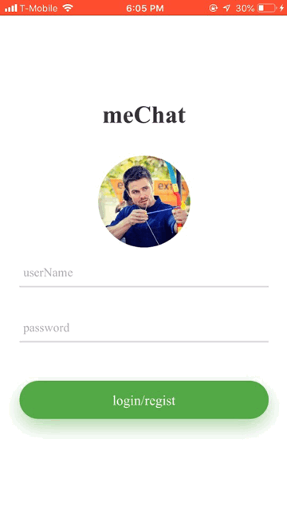
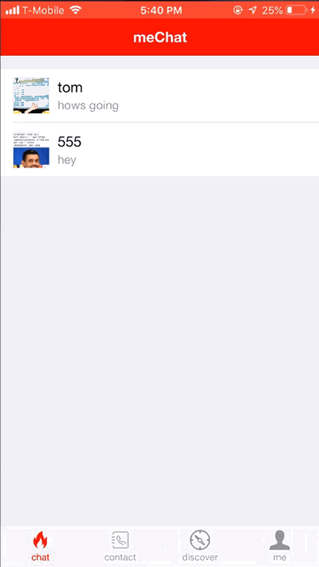

# WeChat clone

A WeChat clone that can be used on both iOS and Android devices.

## Overview

Front-end is built using JavaScript and [HBuilder](https://www.dcloud.io/). HBuilder is platform to create apps that can be used on both iOS and Android. It is base on Vue.js

Back-end is built using Java Spring Boot, Netty, MyBatis, [fastDFS](https://github.com/happyfish100/fastdfs) and MySQL. Created webSockets with Netty for real-time communication. Files are safe using fastDFS install on a Ubuntu VM.

## Features

- Search users by user id or by QR code.

- Users can upload pictures from their devices to use as profile pictures.

- Automatically save chat histroy to local devices.

- Offline message resend. Messages that are delivered to users when they are offline will be saved in the database and will be redelivered to the users once they are online.

- Used heartbeat message to keep websockets open. Once a device is idle for a long time, the websocket will be closed to save memory.

## Demo

